# 🏆 Sports Betting Platform — Sportsbook & Casino Solutions

<div align="center">

**Production-ready sports betting & iGaming platforms — 3 complete versions, from crypto sportsbooks to fully decentralized Web3 betting.**

[](https://t.me/igamezgamble)
[](https://kavenzagaming.com/)

⚽ Soccer · 🏀 Basketball · 🎾 Tennis · 🏓 Table Tennis · 🥊 MMA/UFC · 🎮 eSports — **Live & Pre-match betting** with real-time odds

</div>

---

## 📌 Overview

This repository showcases **three complete, battle-tested sportsbook platforms**, each targeting a different market and technology stack:

| Version | Product | Highlights | Payments |
|:-------:|---------|-----------|----------|
| **[V1](#-version-1--boibook--crypto-sportsbook)** | 🟢 **BoiBook** | Crypto sportsbook + full admin back office | Crypto (SOL) & fiat (XAF) |
| **[V2](#-version-2--betfrenzy--sportsbook--casino-platform)** | 💚 **BetFrenzy** | Sportsbook + Casino, bonuses, raffles & promos | Mobile Money & fiat (XAF) |
| **[V3](#-version-3--web3-decentralized-sportsbook-azuro)** | 🟣 **Web3 Sportsbook** | Fully decentralized, on-chain betting (Azuro) | Wallet connect, AZUSD on Polygon |

Every version ships with **live in-play betting, pre-match markets, single & multi (parlay) bet slips, real-time odds feeds, and multi-language support**.

---

## 🟢 Version 1 — BoiBook · Crypto Sportsbook

A sleek dark-theme crypto sportsbook with a complete **admin back office**. Supports decimal & American odds, deep market coverage (1x2, Asian Handicap, Over/Under, half markets and more), live match tracker, and a crypto wallet with instant deposits & withdrawals.

### 🎬 Demo Video

[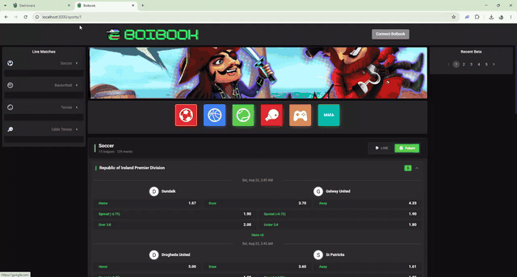](docs/version-1/sports-betting-1.mp4)

*▶️ Click the preview above to watch the [full video](docs/version-1/sports-betting-1.mp4)*

### ✨ Key Features

- ⚡ **Live & pre-match betting** — real-time scores and odds across 17+ leagues, 130+ daily events
- 🧾 **Smart bet slip** — Single & Multi modes, live payout estimation, recent bets history
- 📊 **Rich markets** — 1x2, Asian Handicap, Spread, Over/Under, 1st Half markets, "More +" expandable odds
- 💰 **Crypto wallet** — on-site balance, deposits & withdrawals (SOL, XAF and easily extendable tokens)
- 🌍 **Multi-language** ready

### 🖼️ Screenshots

| Sportsbook Home & Bet Slip | Match Detail & Markets |
|:---:|:---:|
| 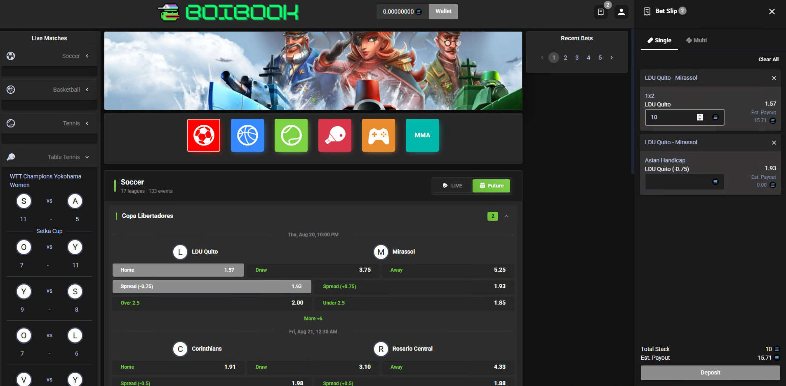 | 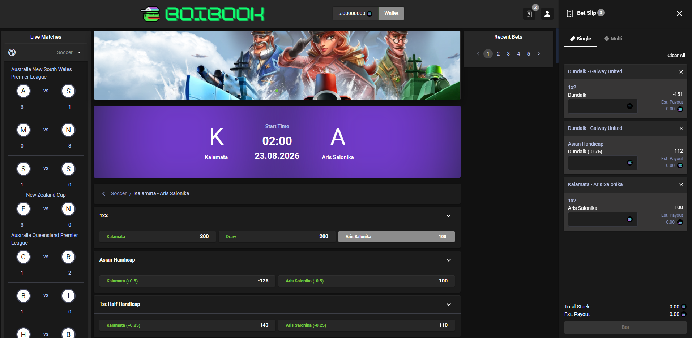 |

| | |
|:---:|:---:|
| 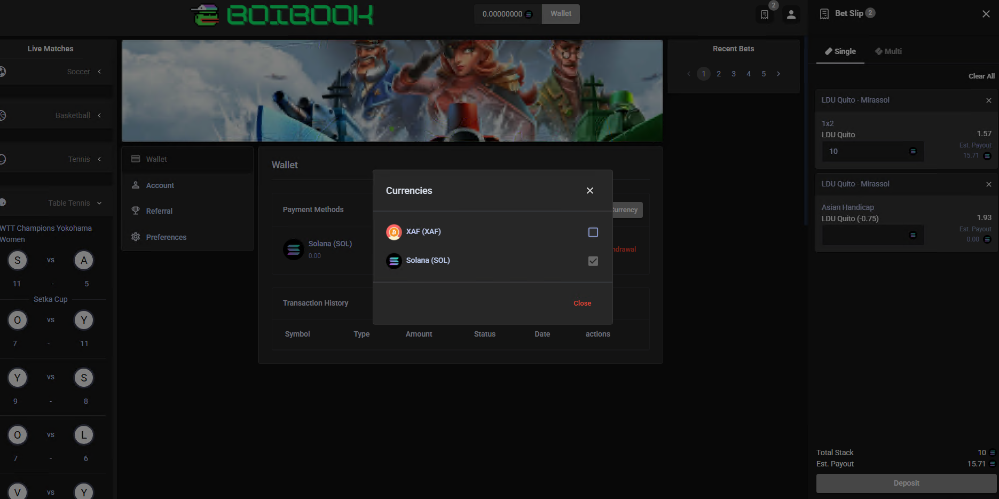 | 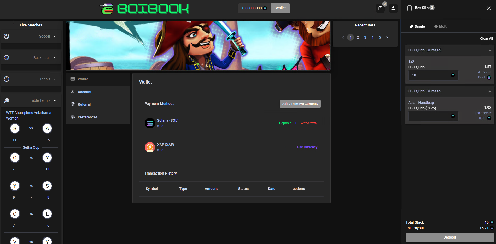 |
| 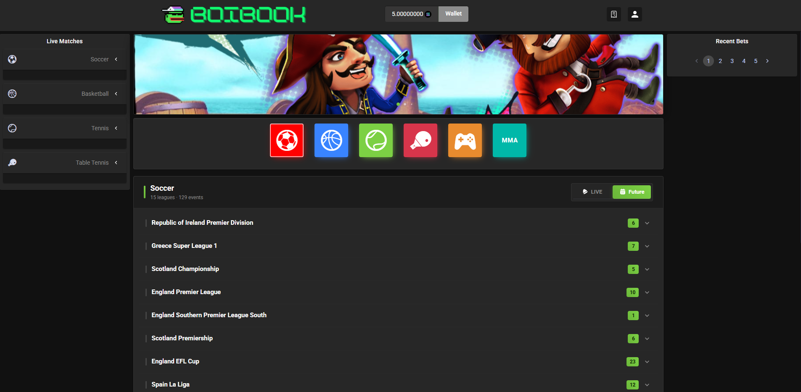 | 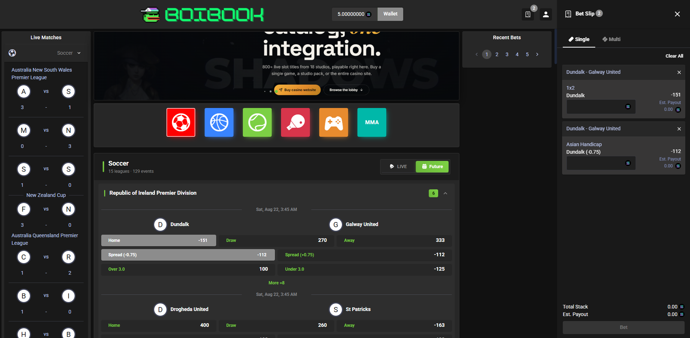 |
| 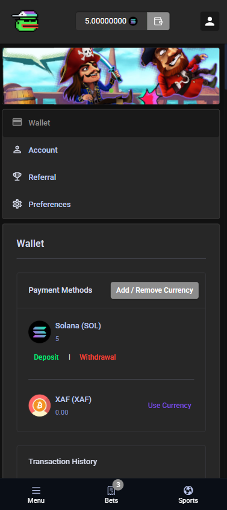 | |

### 🛠️ Admin Back Office

Full-featured admin panel: player analytics (logins, registrations, active players), **per-token balance / deposit / withdrawal tracking**, sports P&L reporting (profit, total bets, active bets, win/lost/refund), user management, sports & match management, brackets, payments, advertisement and language modules.

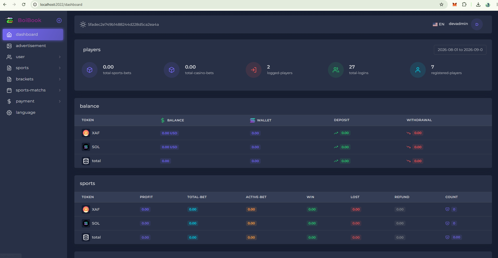

---

## 💚 Version 2 — BetFrenzy · Sportsbook + Casino Platform

A complete **iGaming platform combining Sportsbook and Casino**, built for high-volume markets with fiat & Mobile Money payments (XAF), aggressive promo tooling, and a conversion-optimized UX.

### 🎬 Demo Video

[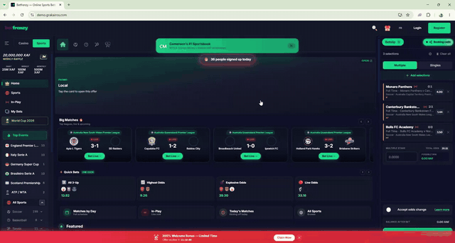](docs/version-2/sports-betting-2.mp4)

*▶️ Click the preview above to watch the [full video](docs/version-2/sports-betting-2.mp4)*

### ✨ Key Features

- 🎰 **Casino + Sports** in one wallet and one account
- 🎁 **Promotions engine** — welcome deposit bonuses (e.g. 200% up to 100,000 XAF), countdown offers, daily/weekly/monthly raffles & jackpots
- 📱 **Mobile Money & instant payments** — instant deposits, fast withdrawals
- 🔗 **Booking codes** — share & load bet slips with a single code
- ⚡ **Quick Bets** — one-click accumulator suggestions (All 1-Up, All 2-Up, Highest Odds)
- 📅 **Live / Upcoming / Matches-by-Day** views with odds grid (Full Time, Over/Under, 1st Half)
- 🌍 **Multi-language** (EN / FR) — tailored for African & international markets
- ✅ Accept-odds-change toggle, balance-after-bet preview, possible-win calculation

### 🖼️ Screenshots

| Home, Promos & Bet Slip | Odds Grid & Multiple Bets |
|:---:|:---:|
| 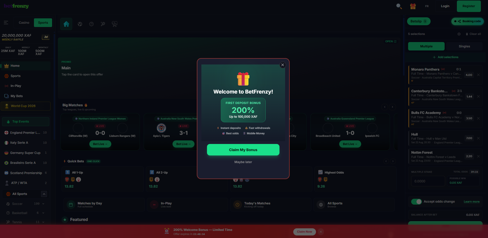 | 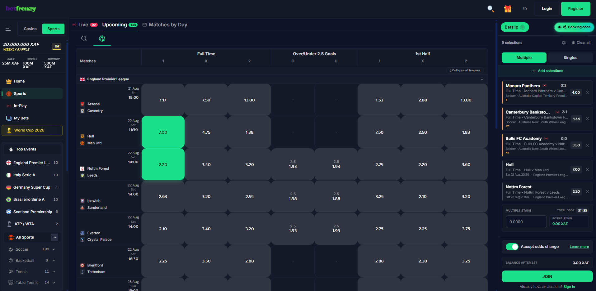 |

| | |
|:---:|:---:|
| 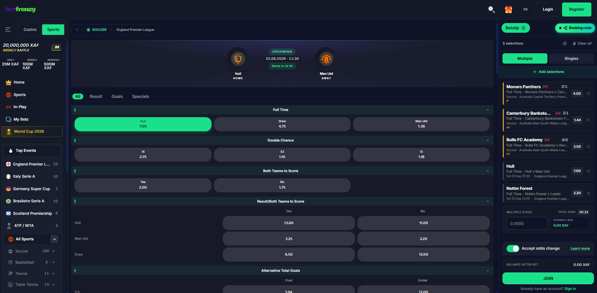 | 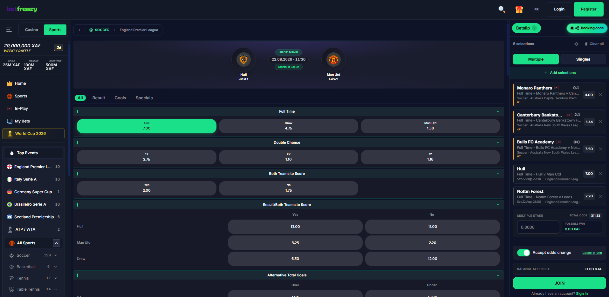 |
| 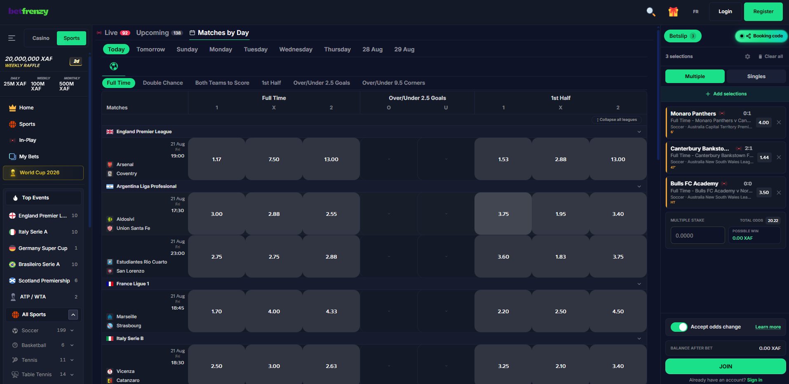 | 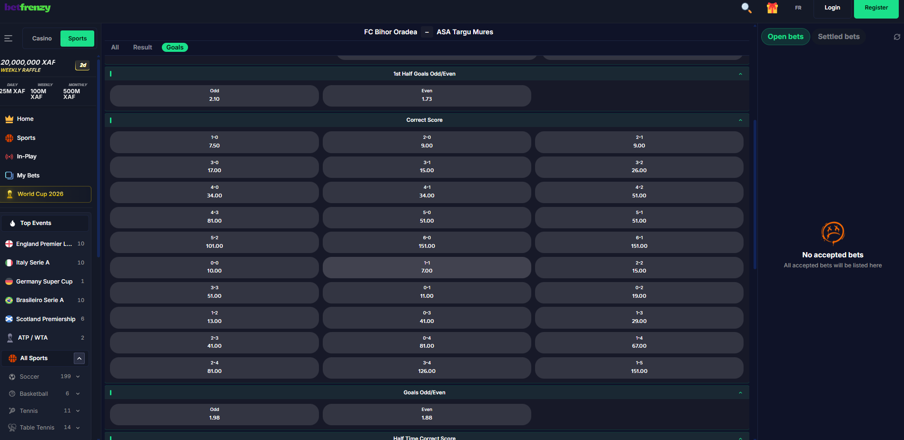 |
| 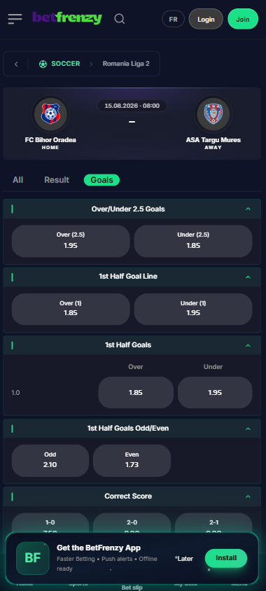 | |

---

## 🟣 Version 3 — Web3 Decentralized Sportsbook (Azuro)

A **fully on-chain, non-custodial sportsbook** built on the **Azuro protocol**. Players connect their own wallet (MetaMask & more), deposit stablecoins, and place bets that settle transparently on-chain — no traditional account required.

### 🎬 Demo Video

[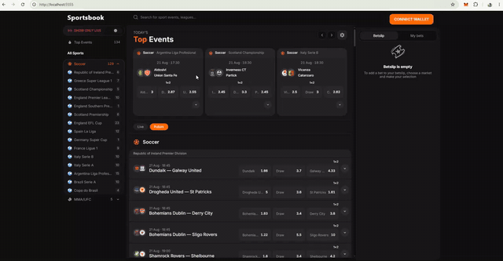](docs/version-3/sports-betting-3.mp4)

*▶️ Click the preview above to watch the [full video](docs/version-3/sports-betting-3.mp4)*

### ✨ Key Features

- 🦊 **Wallet-native UX** — connect / disconnect with MetaMask and other wallets, bet directly from your address
- ⛓️ **On-chain settlement** — powered by the Azuro protocol liquidity layer
- 💵 **Stablecoin betting** — AZUSD deposits on Polygon (testnet-ready on Polygon Amoy, mainnet-ready architecture)
- 🌊 **Azuro Wave Points** — built-in loyalty & rewards integration
- 🔴 **Live betting** — "Show only live" filter, real-time in-play odds across dozens of leagues
- 🌍 **Global coverage** — 100+ soccer leagues, MMA/UFC and more, with search across events & leagues

### 🖼️ Screenshots

| Sportsbook & Wallet Profile | On-chain Deposit Flow |
|:---:|:---:|
| 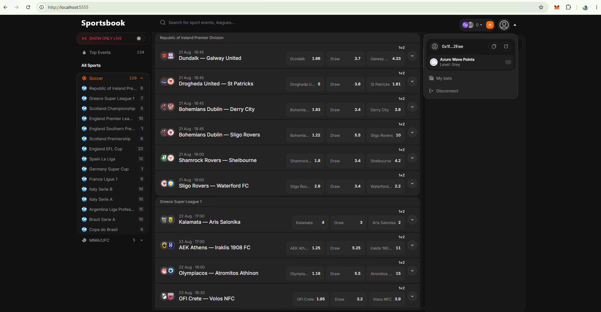 | 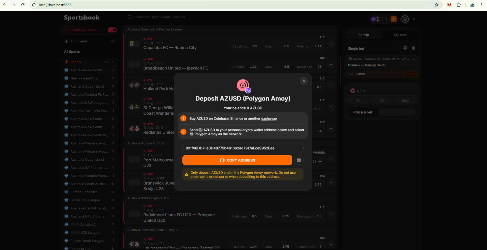 |

| Live Betting |
|:---:|
| 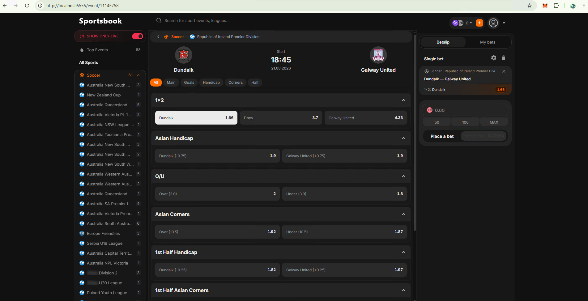 |

---

## 🏛️ Universal Base Architecture & Monorepo Layout

The repository is structured as a **Universal Monorepo** with clear separation between application services (`apps/`) and project documentation (`docs/`).

```
Sports-Betting-SportsBook/
├── apps/
│   ├── backend/        # Node.js, Express, TypeScript API Server
│   ├── frontend/       # Sportsbook React Client Application
│   └── admin/          # Admin Dashboard React Application
├── docs/               # Architecture docs & product media
│   ├── version-1/
│   ├── version-2/
│   └── version-3/
├── package.json        # Root workspace orchestration
└── README.md
```

### ⚡ Running Services via Root Workspace Commands

You can run individual apps directly from the root workspace:

```bash
# Start Backend API Server
npm run dev:backend

# Start Frontend Sportsbook Client
npm run dev:frontend

# Start Admin Dashboard
npm run dev:admin

# Build all applications
npm run build
```

---

## 🚀 Why Choose Our Platforms?

- ✅ **Proven in production** — real products, not templates
- 🎨 **Fully customizable** — branding, odds formats, markets, tokens, languages
- 🔌 **Odds feed integration** — live & pre-match data across all major sports
- 💳 **Flexible payments** — crypto, stablecoins, Mobile Money, fiat
- 🛠️ **Complete back office** — players, finances, sports, matches, promos
- 📱 **Responsive** — desktop & mobile optimized
- 🤝 **Full source code delivery, deployment support & long-term maintenance available**

---

## 📞 Contact & Purchase

<div align="center">

**Interested in a demo, custom build, or white-label license?**

💬 **Telegram:** [https://t.me/igamezgamble](https://t.me/igamezgamble)

🌐 **Product website:** [https://kavenzagaming.com/](https://kavenzagaming.com/)

*Custom features, reskins, new payment integrations and turnkey deployment — all available on request.*

</div>

---

<div align="center">

⭐ **If you find this project interesting, give it a star!** ⭐

`sportsbook` · `sports-betting` · `igaming` · `casino` · `crypto-betting` · `web3` · `azuro` · `polygon` · `solana` · `betting-platform` · `bookmaker-software`

</div>
